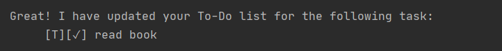

# User Guide

Ace is a desktop app personal assistant for managing tasks list, optimised for use via the Command Line Interface (CLI). You can put in your todos, deadlines and events and Ace will manage them for you. 

* [Quick Start](#quick-start)
* [Features](#features)
    + [1. list](#1-list)
    + [2. todo](#2-todo)
    + [3. deadline](#3-deadline)
    + [4. event](#4-event)
    + [5. find](#5-find)
    + [6. done](#6-done)
    + [7. delete](#7-delete)
    + [8. help](#8-help)
    + [9. bye](#9-bye)
    + [10. Saving the Data](#10-saving-the-data)
* [Note About Date Format](#note-about-date-format)
* [FAQ](#faq)
* [Command Summary](#command-summary)

## Quick Start

1. Ensure that you have java `11` installed in your computer.
2. Download the latest iP.jar.
3. Copy it to the folder you want to store your tasks in.
4. Run the .jar file in the command prompt as follows: `java -jar iP.jar`
5. Ace will show the deadline and events you have for today.
6. Type `help` to see what you can do with this personal assistant.

## Features 

```
Notes about command format:  

1. Words in _italics_ are parameters to be provided by the user.
2. Words in {} are optional parameters. 
3. Casing doesn't matter for the commands. For example: `list` is the same as `List` or `LiSt`. 
4. Dates for deadline and event can only be entered in the format: dd-mm-yyyy {HH:mm}.
```

Following is the list of features available:
* `list`: Provides a list of your tasks.
* `todo`: Add a todo to your tasks.
* `deadline`: Add a deadline to your tasks.
* `event`: Add an event to your tasks.
* `find`: finds tasks that contain a certain keyword.
* `done`: Marks a task as done.
* `delete`: deletes a task.
* `help`: Gives a list of available commands and their syntax.
* `bye`: exits the application.

### 1. list 
Displays a list of your current tasks with markers to identify the tasks type and whether it is done.

##### Usage

Format: `list`

### 2. todo
Adds a todo task to the existing list of tasks in the following format: 

`[T][X] <taskname>`

##### Usage

Format: `todo` _taskname_

Example of usage: 

`todo` read book

Sample outcome:


### 3. deadline
Adds a deadline to the existing list of tasks in the following format: 

`[D][X] <taskname>(by: <date>)` where date is MMM dd yyyy {HH:mm}, eg: Oct 10 2020

##### Usage

Format: `deadline` _taskname /by dd-mm-yyyy {HH:mm}_

Example of usage: 

`deadline` return book /by 20-10-2020

Sample outcome:


### 4. event
Adds an event to the existing list of tasks in the following format: 

`[E][X] <taskname>(on: <date>)` where date is MMM dd yyyy {HH:mm}, eg: Oct 10 2020

##### Usage

Format: `event` _taskname /by dd-mm-yyyy {HH:mm}_

Example of usage: 

`event` book conference /on 20-10-2020 14:45

Sample outcome:


### 5. find
Finds all the tasks that contain the given keyword.

##### Usage

Format: `find` _keyword_

Example of usage:

`find` conference

Sample outcome:


### 6. done
Marks the task at the given task number as done.

##### Usage

Format: `done` _tasknumber_

Example of usage:

`done` 1

Sample outcome:



### 7. delete
Deletes the task with the given task number.

##### Usage

Format: `delete` _tasknumber_

Example of usage:

`delete` 1

Sample outcome:


### 8. help
Displays a list of commands/features you can use with their syntax.

##### Usage

Format: `help`

### 9. bye
Saves your updated tasks list in a text file data/duke.txt and exits the program.

##### Usage

Format: `bye`

### 10. Saving the Data
The updated task list is automatically saved in the text file data/duke.txt at every successful exit from Ace. This data is loaded as soon as the application starts.
Ace displays all tasks due on the day you open the application by filtering out tasks from this loaded data.

## Note About Date Format
* Format for date to be entered for a deadline or event is **dd-mm-yyyy {HH:mm}**.
* Format in which dates are stored and printed is **MMM dd yyyy {HH:mm}**.
* The description of these formats are as follows:
    + dd - date as a 2 digit number. Values range between 01 and 31, both included.
    + mm - month as a 2 digit number. Values range between 01 and 12, both included.
    + yyyy -  year as a 4 digit number.
    + MMM - first three letters of the month.
    + HH:mm - time in 24-hr format.

## FAQ

**Q:** What to do if I see the ticks and crosses for my tasks as `?`?

Run the following command on your command prompt:


If you still don't see the ticks/crosses, change the font of your command prompt to NSimSun.

## Command Summary

Action | Format | example
-------- | ---------- | ------------
list | `list` | -
todo | `todo` _taskname_ | `todo` read book
deadline | `deadline` _taskname /by dd-mm-yyyy {HH:mm}_ | `deadline` return book /by 20-10-2020
event | `event` _taskname /by dd-mm-yyyy {HH:mm}_ | `event` book conference /on 20-10-2020 14:45
find | `find` _keyword_ | `find` conference
done | `done` _tasknumber_ | `done` 1
delete | `delete` _tasknumber_ | `delete` 1
help | `help` | -
bye | `bye` | -